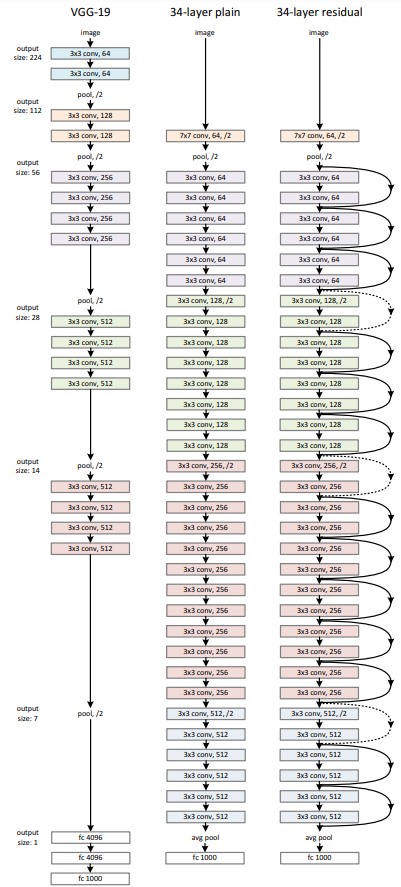

# ResNet Implementation in PyTorch
Implementation of the ResNet model in PyTorch. Based on the architecture from the paper: https://arxiv.org/abs/1512.03385.  

Inspired by the torchvision implementation: https://github.com/pytorch/vision/tree/main.

Trained on CIFAR-10 dataset: https://www.cs.toronto.edu/~kriz/cifar.html.

### Settings

### Results
|   |         | ResNet-34 |  ResNet-50 |
|---|------------------------|----------------|--------------------------|
|   | # of Trainable Params  | ...M | ...M |
|   | Test Accuracy | xx.x% | xx.x% |
